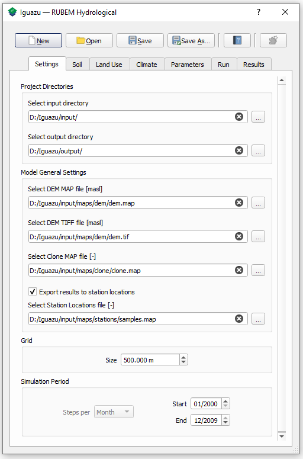
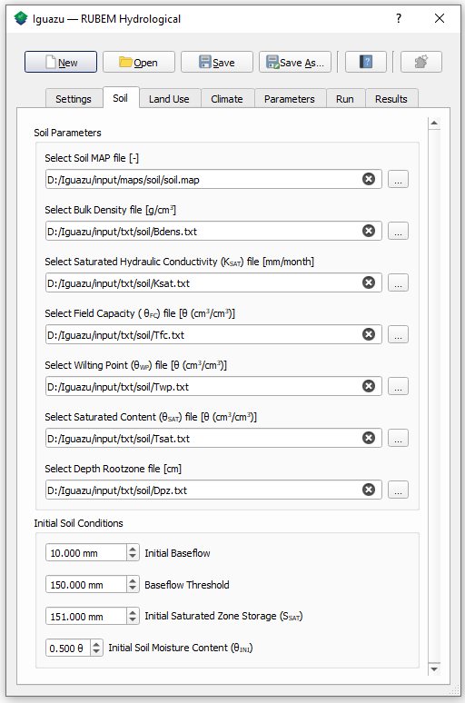
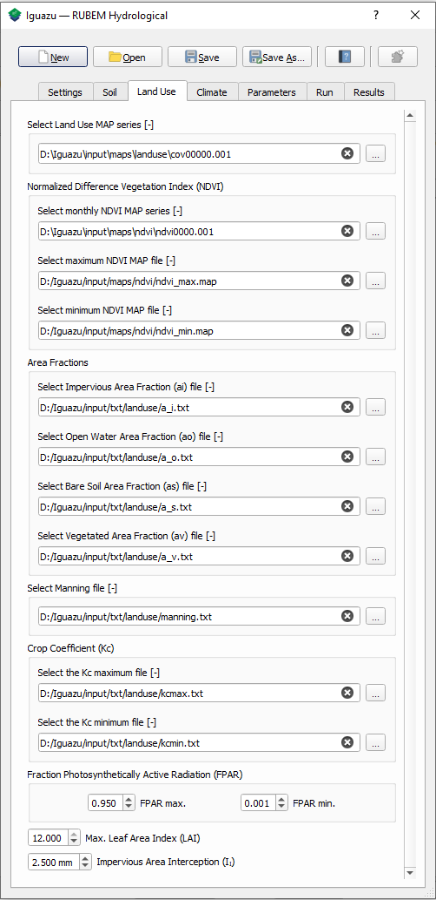
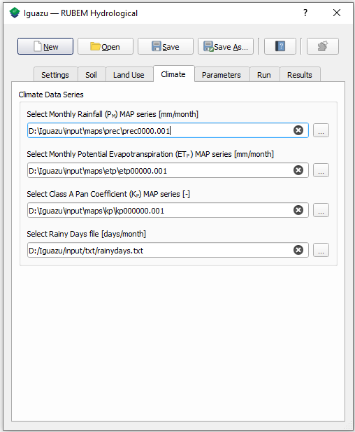
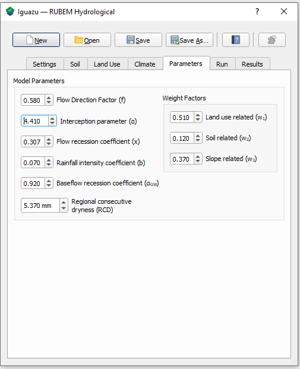
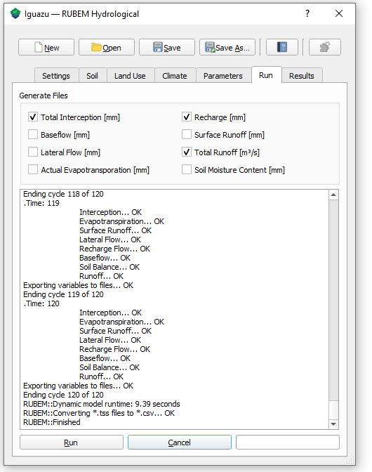
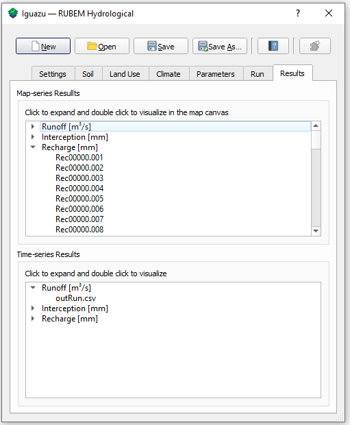
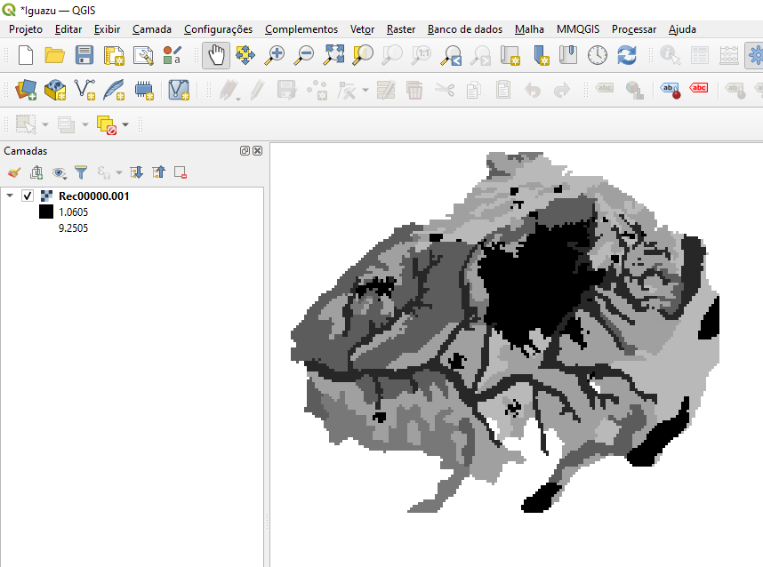
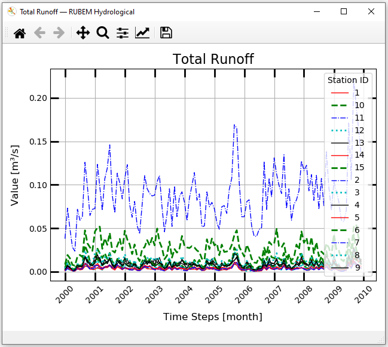

Tutorials
=========

Alto Iguaçu River Basin Minimal Example
---------------------------------------

In this section an example of application of the model in the Brazilian basin of the Alto Iguaçu river is presented. For this case study you need to download the respective required dataset which is available on the :doc:`datasets page </datasets>`.

For this example, we will set up the RUBEM model for ten years: 2000 to 2009. For this period, we will set up a 500 x 500 m spatial resolution (grid cell size). All maps used in this tutorial are in the WGS 84 ESPG 2346 projection. In this tutorial, each step to set up the model is discussed. 


Create a new project
`````````````````````

Click ``New`` and save your new project in the downloaded dataset directory. Name the project :file:`Iguazu.ini` or another appropriate filename. Then, in the section ``Project Directories`` select the dataset directory as ``input directory`` and a preference folder directory as ``output directory``
 
.. _initial-settings:

Initial Settings
````````````````

In the part ``Model General Settings``, mark the ``Export results to station locations`` option and select the appropriate maps from the input directory (Dataset :file:`maps` folder), as indicated in the table below.

+----------------------------------------------------------+
| Model General settings                                   |
+===========+==============================================+
| DEM MAP   | :file:`/Iguazu/maps/dem/dem.map`             |
+-----------+----------------------------------------------+
| DEM TIFF  | :file:`/Iguazu/maps/dem/dem.tif`             |
+-----------+----------------------------------------------+
| Clone MAP | :file:`/Iguazu/maps/clone/clone.map`         |
+-----------+----------------------------------------------+
| Stations  | :file:`/Iguazu/maps/stations/samples.map`    |
+-----------+----------------------------------------------+

In the part ``Grid`` set ``500.000 m`` as size value and in the part ``Simulation Period``, set the ``Start`` and ``End`` of the simulation, from ``January 2000`` until ``December 2009``. 

The figure below shows an overview of the ``Settings`` tab at this point.



---------------       

Soil settings
``````````````

Go to the ``Soil`` tab in the RUBEM Hydrological interface. In the parts for ``Soil Parameters`` input maps and tables need to be provided for different physical soil parameters. Select to ``soil map file`` from the :file:`/input/maps/soil` directory. This map has the soil types in the basin. The numerical values in this map correspond to the categorized soil types defined from the Brazilian Soil Classification System. The folder :file:`/input/txt/soil` contains tables with the values of the soil parameters coupled to each soil type. Select the corresponding table at each field (e.g. :file:`/input/txt/soil/Ksat.txt` in Saturated Hydraulic Conductivity). Set the following values for ``Initial Soil Conditions`` fields:

+------------------------------------------+
| Initial Soil Conditions                  |
+================================+=========+
| Initial Baseflow               | ``10``  |
+--------------------------------+---------+
| Baseflow Threshold             | ``150`` |
+--------------------------------+---------+
| Initial Saturated Zone Storage | ``151`` |
+--------------------------------+---------+
| Initial Soil Moisture Content  | ``0.5`` |
+--------------------------------+---------+

The figure below shows an overview of the ``Soil`` tab at this point.



---------------       

Land Use settings
``````````````````
 
Land Use informations are located at :file:`/input/maps/landuse/` and :file:`/input/maps/ndvi/` directories. These directories contain input maps (map-series) for landuse and NDVI. The filenames in :file:`ndvi` folder have a strict numbering format: :file:`ndvi0000.001` until :file:`ndvi0000.228` in a monthly base. In folder :file:`landuse`, files correspond to annual maps, :file:`cov00000.001` – :file:`cov00000.013`. For landuse, RUBEM use the prior map when map correspond to current timestep (1 - Jan/2000 to 132-Dec/2010) is this example) does not exist in the directory.
 
Select :file:`cov00000.001` as ``Land Use map series``, :file:`ndvi0000.001` for ``Normalized Difference Vegetation Index`` and the corresponds :file:`.map` for maximum and minimum NDVI. 
 
Similar to the soil tab, the folder :file:`/input/txt/landuse` contains tables with the values of the land use parameters coupled to each cover type, select the corresponding table at each field (e.g. :file:`/input/txt/landuse/manning.txt` in Manning file). Use default values for ``FPAR``, ``LAI`` and ``Impervious Area Interception``.
 
The figure below shows an overview of the ``Land Use`` tab at this point.




---------------       

Climate settings
`````````````````
 
In the ``Climate`` tab select the appropriate map-series from :file:`/input/maps/prec/` for ``Precipitation [mm/month]``, :file:`/input/maps/etp/` for ``Potential Evapotranspiration [mm/month]``, and :file:`/input/maps/kp/` for ``Class A Pan Coefficient [-]``. In the ``Rainy days`` section select the appropriate file from :file:`/input/txt/`. It should be noted that the start date always has to correspond with the first climate forcing file (:file:`*.001`). 

The figure below shows an overview of the ``Climate`` tab at this point.



---------------       

Parameters Settings
````````````````````

Values in this tab correspond to calibrated parameters in the basin. For the dataset, the figure below shows the values. The model calibration requires a trial and error approach when RUBEM Hydrological (plugin) is the only tool used. It is possible to adapt RUBEM (code) for using optimization tools for calibration e.g. `Scipy library algorithms <https://scipy.org>`__. 



---------------       

Model Execution Settings
````````````````````````

The figure below represents an overview of the Report options tab. Within this section it's necessary to specify for each variable if you want this to be reported as model output yes or no. The ``Generate Files`` Section shows a list with all the variables that can be reported as model output.

In the example below  it can be seen that ``Recharge``, ``Total Runoff`` and ``Total Interception`` are checked to be reported. If ``Export Results to stations locations`` in the Settings tab was checked, time-series for the selected variables will be generated.

Select the variables of interest and click on the ``RUN`` button. If all information and files are correct a success message will appear.

The figure below shows an overview of the ``Run`` tab at this point.



---------------       

Visualize Results
``````````````````

An overview of the Visualize results tab is shown in Figure below. If no model run has been performed yet, or if nothing was reported in the Report options tab, then the list widgets in this tab will be completely empty. A distinction has been made between time-series output and map-series output as commented below. 


The figure below shows an overview of the ``Results`` tab at this point.



---------------       

Visualize Map-series Results
''''''''''''''''''''''''''''

An output map (raster format) can be added to the canvas by selecting the map of interest from the list separated by variable name, each time-step of the simulation period produces a map with the results for the corresponding month. Figure below shows the map for the Recharge of the first month.




---------------       

Visualize Time-series Results
''''''''''''''''''''''''''''''

Time-series plots can be shown for the locations that are defined in the Stations map in the :ref:`initial-settings`. In order to show a time-series it is necessary to select :file:`.csv` files for the variable of interest from the list and double click.

A time-series plot will be shown (Figure below). The buttons in the top of the window allow you to zoom in and zoom out of your graph, pan through the graph, change axis and label settings, and save your graph to an image file.




-----------------

Ipojuca River Basin Minimal Example
-------------------------------------

In this section, a video example of application of the model in the Brazilian basin of the Ipojuca river is presented. For this case study you need to download the respective required dataset which is available on the datasets page. :doc:`datasets page </datasets>`.

..  youtube:: R8CcLSkLj0Q
    :width: 100%
